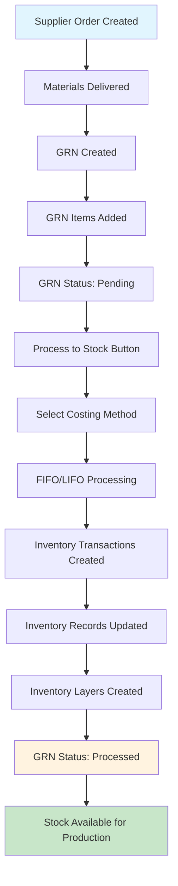
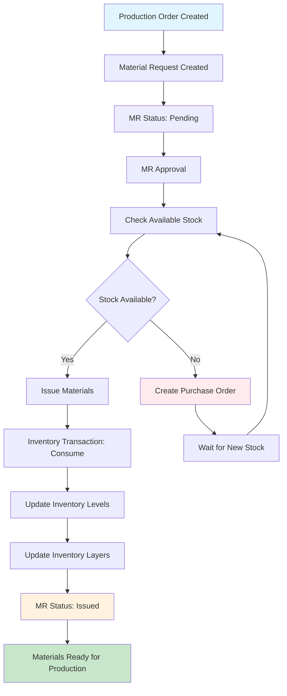
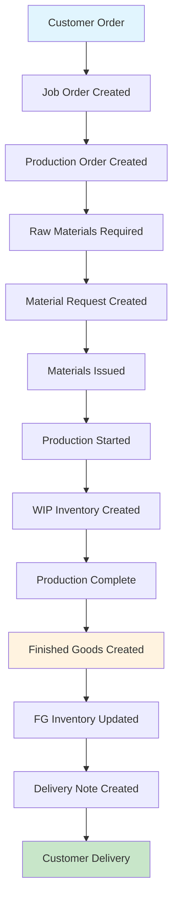
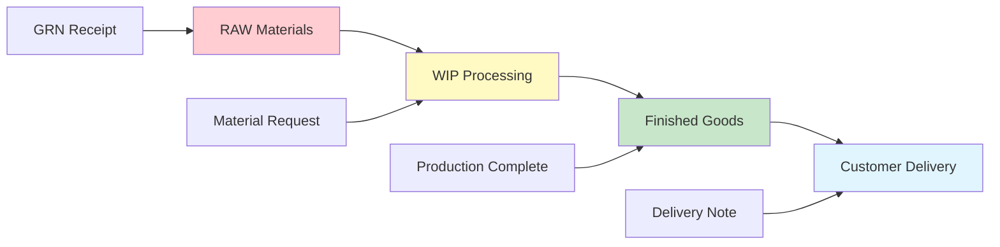
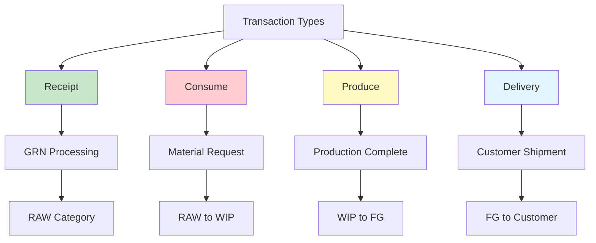
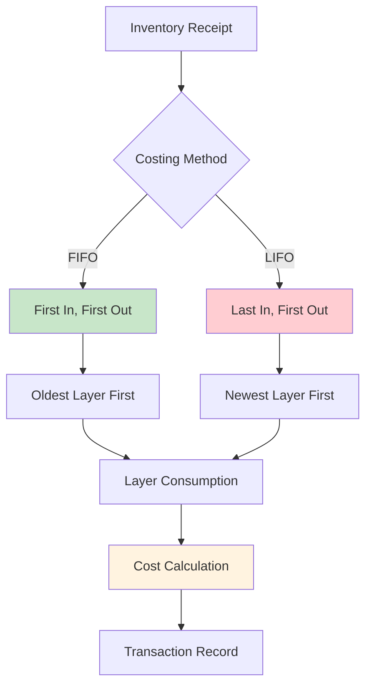
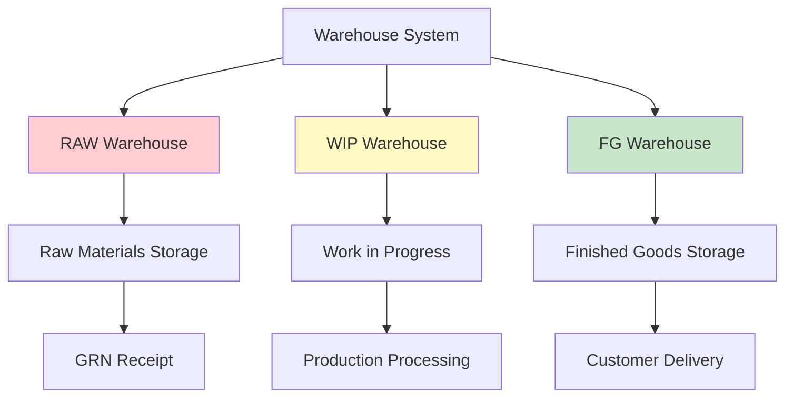
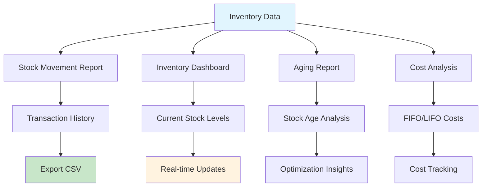
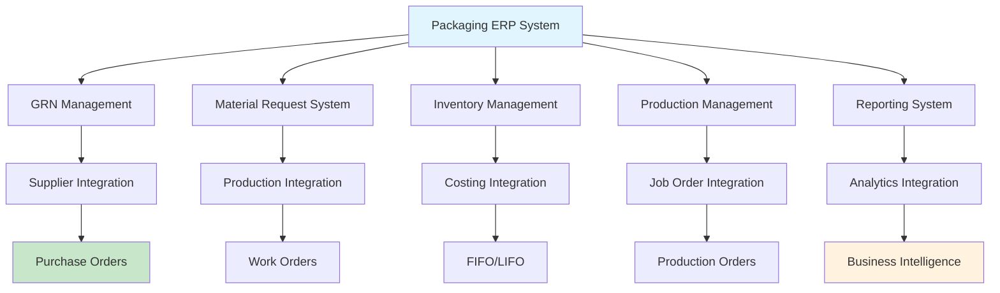
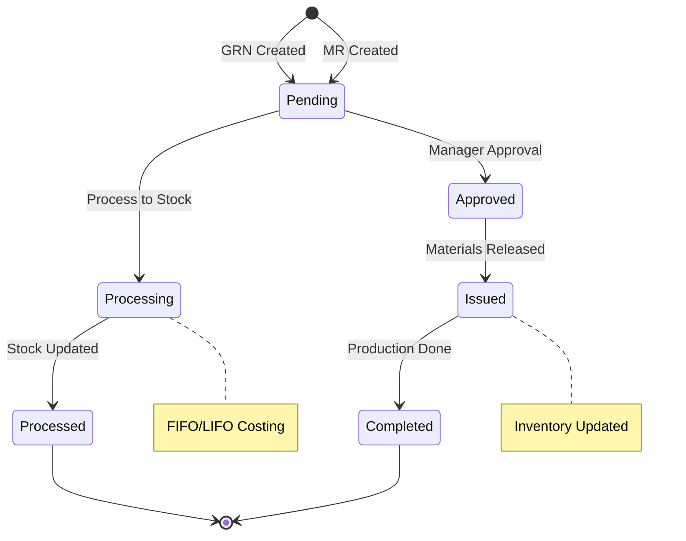

# 🔄 GRN & Material Request Workflow Diagrams

## Overview
This document contains workflow diagrams for the GRN (Goods Receipt Note) and Material Request processes in the Packaging ERP system.

---

## 📦 GRN (Goods Receipt Note) Workflow

---

## 📝 Material Request Workflow

---

## 🏭 Complete Production Workflow

---

## 📊 Inventory Flow Diagram

---

## 🔄 Transaction Types Flow

---

## 💰 Costing Methods Flow

---

## 🏢 Warehouse Management Flow

---

## 📈 Reporting & Analytics Flow

---

## 🔧 System Integration Flow

---

## 📋 Status Flow Diagram

---

## 🎯 Key Workflow Benefits

1. **Visual Process Understanding**: Clear flow from start to finish
2. **Decision Points**: Shows where approvals and checks occur
3. **Integration Points**: How different systems work together
4. **Status Tracking**: Current state of each process
5. **Error Handling**: What happens when issues occur

---

## 📊 Workflow Metrics

- **GRN Processing Time**: Average time from receipt to stock
- **Material Request Fulfillment**: Time from request to issue
- **Inventory Turnover**: How quickly stock moves through system
- **Cost Accuracy**: FIFO/LIFO costing precision
- **Traceability**: Complete audit trail maintenance

These workflow diagrams provide a **comprehensive visual guide** to understanding how GRN and Material Request processes work in your Packaging ERP system! 🚀
